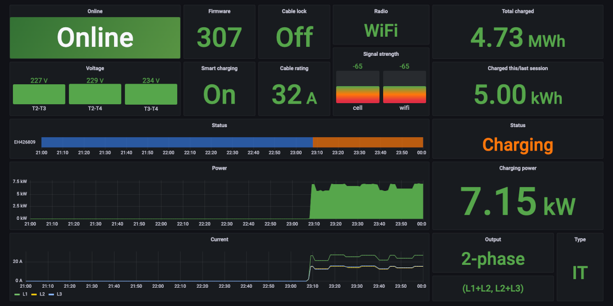

# Easee prometheus exporter

Monitor your Easee EV charger with Prometheus and Grafana.



## Description

This prometheus exporter will connect to the Easee cloud service, periodically fetch charger state and make the metrics available for Prometheus.

See the provided [Grafana dashboard](grafana/dashboard.json) for examples on how they can be used.

## Running

Docker image is available on [ghcr.io](https://github.com/terjesannum/easee-exporter/pkgs/container/easee-exporter).  
Prebuilt binaries for Linux, MacOS and Windows are available on the [release page](https://github.com/terjesannum/easee-exporter/releases/latest).

### Docker compose

If you don't already run Grafana and Prometheus, you can try a complete setup with `docker compose`.

```sh
cd docker-compose
EASEE_USERNAME=... EASEE_PASSWORD=... docker compose up
```

Then go to http://localhost:3000/ and find the dashboards in the General folder.

### Kubernetes

Install in your kubernetes cluster with [Helm](https://helm.sh/). First add the the helm repository:

```
helm repo add easee-exporter https://terjesannum.github.io/easee-exporter/
helm repo update
```

Then install the helm chart:

```
helm install easee-exporter easee-exporter/easee-exporter --set-string username=... --set-string password=...
```

This with install the exporter with the `prometheus.io/scrape` annotation set to `true`. If you run the [Prometheus operator](https://github.com/prometheus-operator/prometheus-operator), install with `serviceMonitor.enabled=true` to create a `ServiceMonitor` instead:

```
helm install easee-exporter easee-exporter/easee-exporter --set-string username=... --set-string password=... --set serviceMonitor.enabled=true
```

### Docker container

```sh
docker run -d -p 8080:8080 -e EASEE_USERNAME=... -e EASEE_PASSWORD=... --restart always ghcr.io/terjesannum/easee-exporter:latest
```

## Prometheus

Prometheus need to be configured to scrape the exporter, so add a scrape job to `/etc/prometheus/prometheus.yml`:
```
scrape_configs:

  - job_name: "easee-exporter"
    scrape_interval: 1m
    static_configs:
      - targets: ["localhost:8080"]
```

## Grafana

Import the [dashboard](grafana/dashboard.json) and select the Prometheus datasource that scrapes the exporter.
